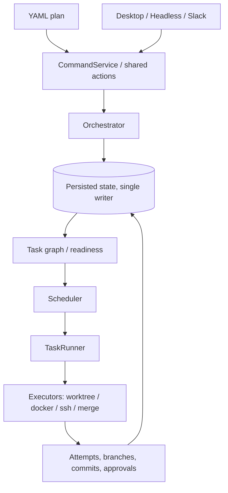

# Getting started

## Develop alongside the packaged production owner

Repository development commands automatically run inside a worktree-specific development profile. `pnpm dev`, `pnpm dev:hot`, `pnpm dev:cli`, `./run.sh`, and the app package's `start`/`dev` scripts derive the same profile from the checkout's real path before starting a process.

The profile lives under `~/.invoker/dev/<profile-id>/` and owns its database, Electron user data, IPC socket, config, environment file, log, and API/web ports. Development also starts with autonomous workers and automatic workflow continuation disabled. The packaged npm application keeps using the production `~/.invoker` namespace.

To reset a development instance, stop only that development process and remove its printed `INVOKER_DB_DIR`; never remove `~/.invoker` itself. Run `node scripts/with-invoker-development-profile.mjs --print-env` to inspect the exact paths without starting Invoker.

The only source-side production exception is the deliberately narrow owner-service form:

```sh
node scripts/with-invoker-development-profile.mjs --production-owner-service -- invoker-cli owner serve
```

Every other source command fails closed if it inherits a production path. `pnpm run check:dev-isolation` inventories the supported launch doors and collision behavior.

Install, configure, and run Invoker. For the product overview, see the [README](../README.md). Version history lives in [CHANGELOG.md](../CHANGELOG.md). Join the community on [Invoker Slack](https://join.slack.com/t/invoker-ai/shared_invite/zt-476imo738-VqNp_SDfI6DFZp80EGgscQ).

## Prerequisites

- **Node.js** 26.x (pinned in [package.json](../package.json) and [.node-version](../.node-version))
- **pnpm** (version pinned in `package.json`)
- **Git**

## Installation

**Recommended (packaged):** Node.js 26.x required. One command installs `invoker-cli` + `invoker-ui`, runs `doctor --fix`, installs skills + local MCP, and enables `pr-status` / `autofix` / `auto-approve`. It does not write Slack tokens or remote machines.

```bash
npx @neko-catpital-labs/invoker-cli@latest install
```

Expected output shape: [install-transcript.txt](install-transcript.txt) (from `invoker-cli install --demo`).

Default Invoker owner is local (`invoker-cli mcp`). In Claude / Cursor / Codex / OMP chat, name a host or IP to use a remote Invoker — the agent probes SSH and retargets MCP only after a successful probe.

**Need Node first?** Optional wrapper installs Node 26 when missing, then runs the same CLI install:

```bash
curl -fsSL https://raw.githubusercontent.com/Neko-Catpital-Labs/Invoker/master/scripts/bootstrap.sh | bash
```

**Source checkout** (contributors):

```bash
git clone https://github.com/Neko-Catpital-Labs/Invoker.git invoker && cd invoker
pnpm install
bash scripts/setup-agent-skills.sh
pnpm run build
```

Every bundled skill carries a `category:` field in its `SKILL.md` frontmatter. By
default `setup-agent-skills.sh` installs all of them; set `INVOKER_SKILL_CATEGORY`
to install only one subset. Use `INVOKER_SKILL_CATEGORY=core` for the skills that
submit and operate Invoker work, or `INVOKER_SKILL_CATEGORY=optimization` for the
verification and review skills.

Invoker does not provision machines for you. You are responsible for bringing your own local workstation, VM, container host, or remote machines and making sure the required tools are installed there before running workflows.

If pnpm skips Electron's dependency install hook and you hit `Electron failed to install correctly`, rerun `pnpm install` or any normal launch command after allowing Electron's build script. Recent pnpm versions may require `pnpm approve-builds`.

For packaged installs, the repo includes npm launchers, direct GitHub Release downloads, an installer script, and a tag-driven release workflow.

### Standalone CLI

The downloaded standalone CLI binary does not require Node after installation. It can run plans directly, or delegate to a running Invoker desktop owner when one is available. The npm package is a launcher that installs and runs that bundled binary as `invoker-cli`.

Prefer the [npx install one-liner](#installation) above. Manual npm path:

```bash
npm install -g @neko-catpital-labs/invoker-cli
invoker-cli --version
invoker-cli install
invoker-cli run plans/fixtures/hello-world.yaml --standalone
```

`invoker-cli install` installs the first-party Invoker AI helper skills under `~/.invoker`, writes an MCP snippet at `~/.invoker/mcp-servers/invoker.json`, and enables default workers (`pr-status`, `autofix`, `auto-approve`). It does **not** modify Cursor / Claude / Codex / OMP configs by default, and it skips Slack/machines. Interactive `invoker-cli setup` asks whether to wire those harnesses (default No); pass `--register-harnesses` to opt in without a prompt (`--yes` alone does not register). Setup still walks Slack and machines when you want them.

Or download the platform binary from GitHub Releases:

```bash
version=0.0.7
case "$(uname -s)" in
  Darwin) platform=darwin ;;
  Linux) platform=linux ;;
  *) echo "Unsupported OS" >&2; exit 1 ;;
esac
case "$(uname -m)" in
  arm64|aarch64) arch=arm64 ;;
  x86_64|amd64) arch=x64 ;;
  *) echo "Unsupported architecture" >&2; exit 1 ;;
esac
curl -L -o invoker-cli "https://github.com/Neko-Catpital-Labs/Invoker/releases/download/v${version}/invoker-cli-${version}-${platform}-${arch}"
chmod +x invoker-cli
./invoker-cli --version
./invoker-cli run plans/fixtures/hello-world.yaml --standalone
```

Release checksums are published as `SHA256SUMS`. To verify a downloaded binary:

```bash
curl -L -O "https://github.com/Neko-Catpital-Labs/Invoker/releases/download/v0.0.7/SHA256SUMS"
shasum -a 256 -c SHA256SUMS --ignore-missing
```

`invoker-cli doctor --fix` can install some missing runtime tools on a best-effort basis using Homebrew on macOS, apt on Linux, or npm for npm-based CLIs. Authentication-dependent setup, such as `gh auth login` and provider CLI login, remains manual.

`invoker-cli run <plan.yaml>` defaults to `auto` mode: it submits the plan to a running desktop owner over IPC when one is reachable, and otherwise runs the plan in a standalone CLI database at `~/.invoker-cli`. Use `--live` to require the desktop owner, `--standalone` to force isolated CLI execution, `--db-dir <path>` to choose a different standalone database directory, and `--json` for a machine-readable result summary.

### Desktop UI

Install the desktop UI launcher with npm:

```bash
npm install -g @neko-catpital-labs/invoker-ui
invoker-ui
invoker-ui doctor
```

Direct desktop downloads are also available from GitHub Releases:
- macOS: `.dmg` and `.zip`
- Linux: `.deb` and `.AppImage`

The macOS npm launcher uses the `.zip` app bundle asset so it does not need to mount a `.dmg`.

For a local maintainer build from the latest `master` commit, including Apple Silicon `.dmg` generation, the standalone `invoker-slack` binary, and unsigned-build quarantine removal, see [local-macos-release-build.md](local-macos-release-build.md) (`bash scripts/local-macos-release-build.sh`).

For desktop binary packages only (no npm/skills), the repo includes an installer script:

```bash
curl -fsSL https://raw.githubusercontent.com/Neko-Catpital-Labs/Invoker/master/scripts/install.sh | bash
```

For CLI + UI + skills/MCP in one step, use `npx @neko-catpital-labs/invoker-cli@latest install` (or the optional Node wrapper [`scripts/bootstrap.sh`](../scripts/bootstrap.sh)).

Tagged releases are configured to publish:
- standalone CLI binaries and `.tar.gz` archives for macOS and Linux on x64 and arm64
- desktop `.dmg`, `.zip`, `.deb`, and `.AppImage`
- `SHA256SUMS` covering release assets

Packaged installs bundle the first-party Invoker AI helpers inside the app. `invoker-cli install` already installs helper skills under `~/.invoker` and the MCP snippet; run `invoker-cli setup` (or System Setup in the desktop app) to optionally register harness MCP/skills (`--register-harnesses` or answer yes to the prompt) and to configure Slack / remote machines.

Then, in Codex, Claude, Cursor, or OMP (after harness registration or a manual snippet merge), ask in normal chat to plan and run durable work through Invoker. `invoker-chat-submit` plus MCP review/submit/status tools prepare a review, wait for one approval, submit, and watch without a slash command.

Explicit fallback:

```text
/invoker-plan-to-invoker "help me plan <change>"
```

Either path writes `plans/invoker-handoff.md`, converts it to `plans/invoker-handoff.yaml`, reviews via MCP, and submits live after one approval.

Source checkouts can install the repo helpers with `bash scripts/setup-agent-skills.sh`.

### Slack

Install the Slack surface launcher with npm:

```bash
npm install -g @neko-catpital-labs/invoker-slack
invoker-slack --help
```

See [slack-native-workflows.md](slack-native-workflows.md) for lobby mentions, harness presets, and per-workflow channels.

## First tutorial

If you are new to Invoker, start with the guided first workflow:

[tutorial-first-agent-workflow.md](tutorial-first-agent-workflow.md)

The tutorial creates a tiny local git repo, generates both Codex and Claude plan files, then walks through the desktop UI: `Open`, `Start`, task graph inspection, terminal/log access, retry behavior, and how to adapt the same plan shape to your own project.

## Configuration

Invoker reads user config from `~/.invoker/config.json`.

If you want a repo-specific config file, point the app at it explicitly:

```bash
INVOKER_REPO_CONFIG_PATH=$PWD/.invoker.local.json invoker-ui
```

The config loader does not automatically read `<repo>/.invoker.json`.

Minimal example:

```json
{
  "maxConcurrency": 6,
  "defaultExecutionHarness": "codex",
  "autoFixRetries": 3,
  "autoFixAgent": "claude",
  "autoFixCi": false,
  "remoteTargets": {
    "staging-a": {
      "host": "203.0.113.10",
      "user": "invoker",
      "sshKeyPath": "/home/you/.ssh/invoker_staging_a",
      "managedWorkspaces": true,
      "remoteInvokerHome": "~/.invoker",
      "provisionCommand": "bash scripts/provision-ssh-worker.sh ensure-repo-ready"
    },
    "staging-b": {
      "host": "203.0.113.11",
      "user": "invoker",
      "sshKeyPath": "/home/you/.ssh/invoker_staging_b",
      "managedWorkspaces": true,
      "remoteInvokerHome": "~/.invoker",
      "provisionCommand": "bash scripts/provision-ssh-worker.sh ensure-repo-ready"
    }
  },
  "worktreeTargets": {
    "local-default": {
      "provisionCommand": "pnpm install --frozen-lockfile",
      "maxConcurrentTasks": 2
    }
  }
}
```
Managed SSH checkouts only run repo bootstrap when the target defines `provisionCommand`. Local managed worktrees follow the same rule through `worktreeTargets`.

SSH task payloads and remote auto-fix/conflict scripts source `<remoteInvokerHome>/env.sh` directly under non-login `bash -s`; they do **not** rely on user dotfiles at runtime. `scripts/provision-ssh-worker.sh` still installs the same env hook into `.bash_profile`, `.bash_login`, `.profile`, and `.bashrc` so interactive shells pick up the worker PATH too.

`autoFixRetries` is a finite per-task cap. `3` means the worker keeps consumed attempts in process memory and can submit at most three auto-fix attempts for the same failed task lineage; `0` disables auto-fix workers.

More examples: [invoker-config-example.json](invoker-config-example.json), [remote-ssh-targets.md](remote-ssh-targets.md), [docker-executor.md](docker-executor.md).

### Multiple SSH Executors

Define multiple entries under `remoteTargets`, then select them per task with `poolId`.

```yaml
name: multi-remote-example
repoUrl: git@github.com:your-org/your-repo.git
baseBranch: master
tasks:
  - id: test-a
    description: Run checks on remote target A
    command: pnpm test
    poolId: staging-a

  - id: test-b
    description: Run checks on remote target B
    command: pnpm test
    poolId: staging-b
```

Use this when you want Invoker to spread work across machines you already manage. The SSH executor does not provision the hosts for you; it connects to the target you name and runs there.

## Quick start

For a guided first run, use [the first agent workflow tutorial](tutorial-first-agent-workflow.md). It gives you a toy repo and exact UI checkpoints.

For day-to-day use, start the desktop app:

```bash
invoker-ui
```

Or run a plan through the headless surface:

```bash
invoker-ui --headless --help
invoker-ui --headless query workflows
invoker-ui --headless run /path/to/plan.yaml
```

For app development with hot reload:

```bash
pnpm run dev:hot
```

GUI-launched workflows inherit the GUI app environment. On macOS, apps launched from Finder often have a narrower `PATH` than your terminal. If workflows need `pnpm`, `git`, `codex`, or `claude`, start Invoker from a terminal or make those tools available to GUI-launched apps.

**Example plan:**

```yaml
name: ai-feature-hardening
description: |
  Demonstrates a small AI implementation workflow with parallel code paths,
  an SSH-backed verification task, and a pull request review gate.
repoUrl: git@github.com:your-org/your-repo.git
baseBranch: master
onFinish: pull_request
mergeMode: external_review
tasks:
  - id: plan
    description: Ask an AI agent to produce a scoped implementation plan
    prompt: |
      Inspect the repository, identify the smallest implementation slice,
      and produce a concise plan with verification steps.
    executionAgent: codex
    dependencies: []

  - id: api
    description: Implement the API slice in an isolated worktree
    command: pnpm --filter @your-org/api test
    dependencies: [plan]

  - id: ui
    description: Implement the UI slice in an isolated worktree
    prompt: |
      Implement the UI affordance described by the plan. Preserve audit
      state so a failed task can be reopened, edited, and replayed.
    executionAgent: codex
    dependencies: [plan]

  - id: tests
    description: Run the final regression suite on a configured SSH executor
    command: pnpm run test:all
    poolId: staging-a
    dependencies: [api, ui]
```

If you need to turn a product or implementation plan into an Invoker workflow, run `invoker-cli setup` (or System Setup in the desktop app) to install helpers and optionally register harness MCP/skills. Prefer normal chat with `invoker-chat-submit` and MCP tools after harness registration; `/invoker-plan-to-invoker "help me plan <change>"` remains the explicit slash-command fallback.

If you need to operate existing workflows or tasks, use the `invoker-ops` skill.

Use `--output text|label|json|jsonl` on headless `query` commands. Use `invoker-ui --headless retry-tasks --status pending|failed --parallel 8` for bulk safe retries. Inspect recovery ownership and decisions with `invoker-ui --headless worker status --output text|json|jsonl`. Only **one** process should **write** the workflow database at a time; see [persistence-architecture-single-writer.md](persistence-architecture-single-writer.md).

### Auto-fix worker (single shared engine)

Auto-fix recovery runs through **one** shared worker engine in `@invoker/execution-engine`. Starting that worker — the Workers-tab off→on toggle — now runs a full scan immediately, submitting a fix-with-agent intent for every task that is already failed, so turning it on reconciles the current backlog at once. After that startup scan, failure lifecycle events wake it and its periodic scan covers missed wakeups. The manual dev door `invoker-cli worker autofix` runs the same engine for an explicit one-shot scan. `autoFixRetries` is enforced from a worker-local in-memory ledger before the worker submits another fix intent. A sweep-and-assert guard test fails the build if auto-fix is ever triggered outside this shared worker engine. See [architecture/recovery-lifecycle-workers.md](architecture/recovery-lifecycle-workers.md).

## Architecture (at a glance)



Package boundaries and runtime invariants live in [ARCHITECTURE.md](../ARCHITECTURE.md). The longer product story lives in [invoker-medium-article.md](invoker-medium-article.md).

## Core concepts

- **Plan** — YAML: tasks, `dependencies`, and workflow defaults. `baseBranch` defaults to `master`, but you can set an explicit ref like `origin/master` or `upstream/main`.
- **Workflow** — Persisted instance; generation and DB are source of truth.
- **Task / attempt** — DAG node plus immutable execution records; **selected attempt** drives downstream validity and staleness.
- **Executors** — `worktree`, `docker`, `ssh` (isolated workspaces).
- **Surfaces** — Same actions everywhere; mutations go through **CommandService** → **Orchestrator**.

Types: [packages/workflow-graph/src/types.ts](../packages/workflow-graph/src/types.ts).

## Development

| Command | What it does |
| --- | --- |
| `pnpm run dev` | Build UI + app, start Electron |
| `pnpm run dev:hot` | Vite dev server + app |
| `pnpm run build` | Build all packages |
| `pnpm test` | Skill check + package tests (sequential) |
| `pnpm run test:e2e-chaos` | Run the seedable chaos battle-test matrix |
| `pnpm run test:high-resource` | Package tests in parallel |
| `pnpm run test:all` | Full aggregated test script |
| `pnpm run check:all` | Deps graph + types + owner boundary |

Layer rules: [ARCHITECTURE.md](../ARCHITECTURE.md). Agent/repo conventions: [CLAUDE.md](../CLAUDE.md).

## Documentation

| Doc | Use |
| --- | --- |
| [tutorial-first-agent-workflow.md](tutorial-first-agent-workflow.md) | Guided first run on a toy project using Codex or Claude |
| [ARCHITECTURE.md](../ARCHITECTURE.md) | Package layering, mutation boundaries, error contracts |
| [invoker-medium-article.md](invoker-medium-article.md) | Product story, glossary, mapping tables |
| [local-macos-release-build.md](local-macos-release-build.md) | Local Apple Silicon `.dmg` + `invoker-slack` cut (`scripts/local-macos-release-build.sh`) |
| [persistence-architecture-single-writer.md](persistence-architecture-single-writer.md) | SQLite / sql.js single writer |
| [invoker-config-example.json](invoker-config-example.json) | Example `config.json` with local and remote executor settings |
| [remote-ssh-targets.md](remote-ssh-targets.md) | SSH executor setup, target fields, and plan examples |
| [docker-executor.md](docker-executor.md) | Docker executor configuration and runtime notes |
| [slack-native-workflows.md](slack-native-workflows.md) | Plan & drive workflows from Slack: lobby mentions, harness presets, per-workflow channels |
| [web-surface.md](web-surface.md) | Watch & drive workflows from a browser (HTTP+SSE) and the Slack live status card; enabling `INVOKER_WEB_TOKEN` |

## Troubleshooting

- **DB conflicts** — Do not run two writers on the same DB; headless CLI mutations use a standalone owner, while GUI-started workflows stay owned by the desktop app process.
- **`pnpm` or `git` not found from the desktop app** — On macOS this is often a Finder/GUI `PATH` issue. Launch Invoker from a terminal with `invoker-ui`, or make the required binaries available to GUI-launched apps.
- **Missing bundled agent skills** — `bash scripts/setup-agent-skills.sh`
- **Install failures** — Use Node 26 as per `engines`
- **Obsidian (README / Mermaid)** — In **Source** mode the diagram stays plain text. Open **Reading view** (book icon in the header, or the *Toggle reading view* command). **Live Preview** usually renders Mermaid as well; if you see an empty box or a parse error, update Obsidian, try the default theme, and disable CSS snippets (some themes hide Mermaid).

## Contributing

Contributions are welcome — but Invoker is a control system, not a typical app, and changes have to respect the architectural commitments that make it useful (explicit state, narrow mutation paths, hard layer boundaries, executable verification). Read [CONTRIBUTING.md](../CONTRIBUTING.md) before opening a PR.

Roadmap and issue tracker: [invoker.productlane.com/roadmap](https://invoker.productlane.com/roadmap).

## License

[Functional Source License, Version 1.1, ALv2 Future License](../LICENSE) (SPDX: **FSL-1.1-ALv2**). See the [README](../README.md#license) for a short summary; the `LICENSE` file is the controlling text.
