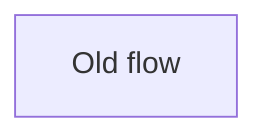
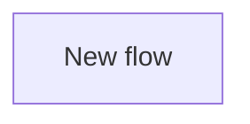

## Summary

Describe what changed and why in plain English.

Write paragraphs, not bullets. Keep each paragraph under 30 words.

Put one idea in each paragraph. If one idea leads to another, split them into separate short paragraphs.
## Review Claim

State the one thing the reviewer is being asked to approve.

## Review Lane

Choose exactly one: `behavior`, `refactor`, `proof`, `cleanup`, `policy`, or `docs`.

## Review Unit

Choose the matching review unit, such as `tooling-policy`, `routing`, or `docs`.

## Safety Invariant

Explain why this slice is safe to review locally.

## Slice Rationale

Explain why this work is split here instead of bundled elsewhere.

## Non-goals

List what this slice explicitly does not change.

For a `refactor` Review Lane, include: `No behavior change.` (or an equivalent accepted unchanged-behavior claim).

## Architecture

Only keep this section if the change affects component interactions, control flow, or data flow.
Quote Mermaid labels when they contain prose, punctuation, or code-ish text like `reviewGate.artifacts[]`.

### Before



### After



## Test Plan

<details>
<summary>Test Plan</summary>

- [ ] `exact command`
- [ ] `exact command`
- Not run: <check>. Blocker: <what stops it>

Keep a `Not run:` row only for a check you could not run, and name what stops it. Delete the row when every check ran.

</details>

## Measured

Paste what the repro or benchmark command printed, before and after this change. Write `none: <reason>` instead when the slice has nothing to measure.

Command: `exact command`

### Base

```text
pasted output from the base commit
```

### Head

```text
pasted output from this branch
```

## Visual Proof

Required when the diff changes UI-impacting files. Include before/after screenshots or a video link.

Manually inspected: state exactly what you saw when you opened the image or video yourself, not just that it was captured.

## Revert Plan

<details>
<summary>Revert Plan</summary>

- Safe to revert? Yes/No
- Revert command: `git revert <sha>`
- Post-revert steps: None
- Data migration? No

</details>
